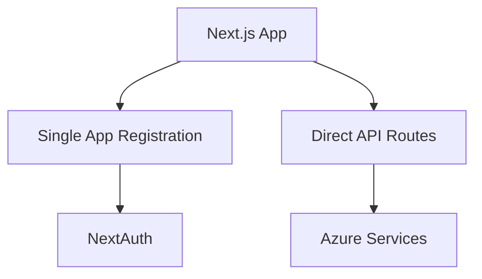
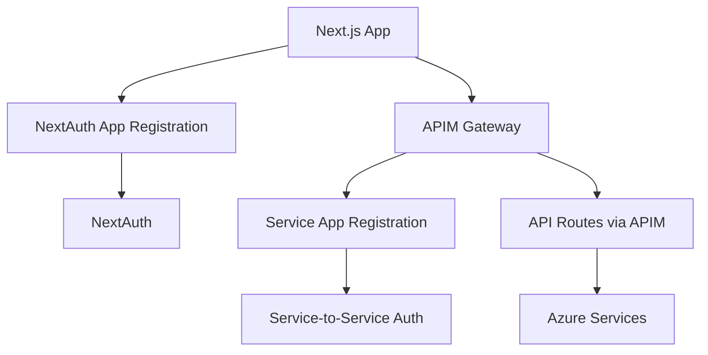

# APIM + Two App Registrations Architecture

## Overview
This document outlines the architectural changes needed to implement API Management (APIM) and separate the authentication concerns using two distinct Azure AD app registrations.

## Current Architecture


## Target Architecture


## App Registration Strategy

### App Registration 1: NextAuth Authentication
- **Purpose**: User authentication and authorization
- **Name**: `{webappname}-nextauth`
- **Audience**: `AzureADMyOrg`
- **Redirect URIs**: 
  - `https://{webappname}.azurewebsites.net/api/auth/callback/azure-ad`
  - `http://localhost:3000/api/auth/callback/azure-ad` (dev only)

**Required API Permissions**:
- Microsoft Graph: `User.Read`
- Microsoft Graph: `openid`, `profile`, `email`

**Configuration**:
```json
{
  "displayName": "{webappname}-nextauth",
  "signInAudience": "AzureADMyOrg",
  "web": {
    "redirectUris": [
      "https://{webappname}.azurewebsites.net/api/auth/callback/azure-ad"
    ],
    "implicitGrantSettings": {
      "enableIdTokenIssuance": true
    }
  },
  "requiredResourceAccess": [
    {
      "resourceAppId": "00000003-0000-0000-c000-000000000000",
      "resourceAccess": [
        {
          "id": "e1fe6dd8-ba31-4d61-89e7-88639da4683d",
          "type": "Scope"
        }
      ]
    }
  ]
}
```

### App Registration 2: Service-to-Service
- **Purpose**: Backend service authentication to Azure resources
- **Name**: `{webappname}-service`
- **Audience**: `AzureADMyOrg`
- **Type**: Service Principal for machine-to-machine communication

**Required API Permissions**:
- Azure Storage: `user_impersonation`
- Azure Cosmos DB: Custom roles
- Azure OpenAI: `user_impersonation`
- Azure Cognitive Services: `user_impersonation`

## APIM Configuration

### APIM Service
```bicep
resource apim 'Microsoft.ApiManagement/service@2023-05-01-preview' = {
  name: '${webappname}-apim'
  location: location
  sku: {
    name: 'Developer' // or 'Standard' for production
    capacity: 1
  }
  properties: {
    publisherName: 'Orchestrix Team'
    publisherEmail: 'admin@orchestrix.io'
    customProperties: {
      'Microsoft.WindowsAzure.ApiManagement.Gateway.Security.Protocols.Tls10': 'False'
      'Microsoft.WindowsAzure.ApiManagement.Gateway.Security.Protocols.Tls11': 'False'
      'Microsoft.WindowsAzure.ApiManagement.Gateway.Security.Backend.Protocols.Tls10': 'False'
      'Microsoft.WindowsAzure.ApiManagement.Gateway.Security.Backend.Protocols.Tls11': 'False'
    }
  }
  identity: {
    type: 'SystemAssigned'
  }
}
```

### API Definitions
```bicep
resource chatApi 'Microsoft.ApiManagement/service/apis@2023-05-01-preview' = {
  parent: apim
  name: 'chat-api'
  properties: {
    displayName: 'Chat API'
    path: 'chat'
    protocols: ['https']
    subscriptionRequired: false
    serviceUrl: 'https://${webApp.properties.defaultHostName}/api'
  }
}

resource chatOperation 'Microsoft.ApiManagement/service/apis/operations@2023-05-01-preview' = {
  parent: chatApi
  name: 'post-chat'
  properties: {
    displayName: 'Send Chat Message'
    method: 'POST'
    urlTemplate: '/chat'
    request: {
      headers: [
        {
          name: 'Authorization'
          type: 'string'
          required: true
        }
      ]
    }
  }
}
```

### Authentication Policies
```xml
<!-- JWT validation policy for user requests -->
<inbound>
  <validate-jwt header-name="Authorization" failed-validation-httpcode="401">
    <openid-config url="https://login.microsoftonline.com/{tenantId}/v2.0/.well-known/openid_configuration" />
    <audiences>
      <audience>{nextauth-app-id}</audience>
    </audiences>
    <issuers>
      <issuer>https://login.microsoftonline.com/{tenantId}/v2.0</issuer>
    </issuers>
  </validate-jwt>
  
  <!-- Add service-to-service token for backend calls -->
  <authentication-managed-identity resource="api://{service-app-id}" />
  
  <!-- Forward to backend -->
  <set-backend-service base-url="https://{webappname}.azurewebsites.net" />
</inbound>
```

## Implementation Requirements

### Bicep Changes Required

1. **Two App Registrations**:
```bicep
// NextAuth App Registration
resource nextAuthAppReg 'Microsoft.Graph/applications@v1.0' = {
  displayName: '${webappname}-nextauth'
  signInAudience: 'AzureADMyOrg'
  // ... configuration
}

// Service App Registration  
resource serviceAppReg 'Microsoft.Graph/applications@v1.0' = {
  displayName: '${webappname}-service'
  signInAudience: 'AzureADMyOrg'
  // ... configuration
}
```

2. **APIM Service and APIs**:
```bicep
module apimModule 'modules/apim.bicep' = {
  name: 'apim-deployment'
  params: {
    apimName: '${webappname}-apim'
    webAppUrl: webApp.properties.defaultHostName
    nextAuthAppId: nextAuthAppReg.appId
    serviceAppId: serviceAppReg.appId
  }
}
```

3. **Updated App Service Configuration**:
```bicep
{
  name: 'NEXTAUTH_CLIENT_ID'
  value: nextAuthAppReg.appId
}
{
  name: 'NEXTAUTH_CLIENT_SECRET'
  value: '@Microsoft.KeyVault(VaultName=${kv.name};SecretName=nextauth-client-secret)'
}
{
  name: 'SERVICE_CLIENT_ID'
  value: serviceAppReg.appId
}
{
  name: 'APIM_GATEWAY_URL'
  value: 'https://${apim.properties.gatewayUrl}'
}
```

### Application Code Changes

1. **NextAuth Configuration**:
```typescript
export const authOptions: NextAuthOptions = {
  providers: [
    AzureADProvider({
      clientId: process.env.NEXTAUTH_CLIENT_ID!,
      clientSecret: process.env.NEXTAUTH_CLIENT_SECRET!,
      tenantId: process.env.AZURE_TENANT_ID!,
    }),
  ],
  callbacks: {
    async jwt({ token, account }) {
      if (account) {
        token.accessToken = account.access_token;
      }
      return token;
    },
  },
};
```

2. **API Client with APIM**:
```typescript
class ApiClient {
  private baseUrl = process.env.APIM_GATEWAY_URL || '';
  
  async makeRequest(endpoint: string, options: RequestInit = {}) {
    const session = await getSession();
    return fetch(`${this.baseUrl}${endpoint}`, {
      ...options,
      headers: {
        'Authorization': `Bearer ${session?.accessToken}`,
        'Content-Type': 'application/json',
        ...options.headers,
      },
    });
  }
}
```

## Migration Steps

1. **Create two app registrations** using enhanced setup scripts
2. **Deploy APIM service** with basic configuration
3. **Update application configuration** to use new auth flow
4. **Configure API policies** for JWT validation and service auth
5. **Update client code** to route through APIM
6. **Test authentication flows** in all environments
7. **Performance and security validation**

## Security Benefits

- **Separation of Concerns**: User auth vs service auth
- **Centralized API Security**: APIM policies and rate limiting
- **Improved Auditability**: All API calls logged through APIM
- **Enhanced Security**: JWT validation at gateway level
- **Service Isolation**: Backend services don't handle user tokens directly