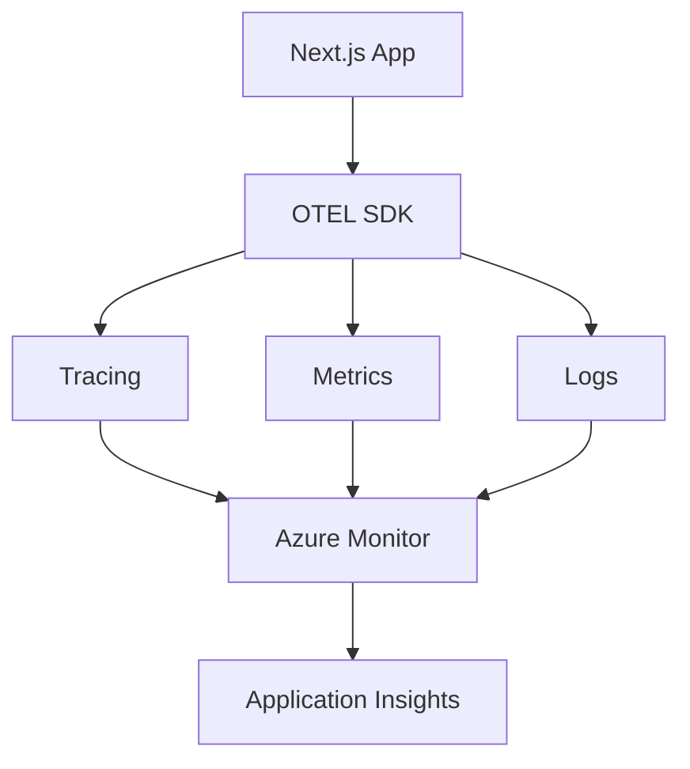

# OpenTelemetry Instrumentation for orchestrix-ui

## Overview
This document outlines how to implement OpenTelemetry (OTEL) observability in the orchestrix-ui application.

## Architecture



## Implementation

### 1. Install Dependencies

```bash
npm install --save \
  @opentelemetry/api \
  @opentelemetry/sdk-node \
  @opentelemetry/auto-instrumentations-node \
  @opentelemetry/exporter-trace-otlp-http \
  @opentelemetry/exporter-metrics-otlp-http \
  @opentelemetry/instrumentation-nextjs \
  @azure/monitor-opentelemetry-exporter
```

### 2. Initialize OTEL (src/lib/telemetry.ts)

```typescript
import { NodeSDK } from '@opentelemetry/sdk-node';
import { getNodeAutoInstrumentations } from '@opentelemetry/auto-instrumentations-node';
import { Resource } from '@opentelemetry/resources';
import { SemanticResourceAttributes } from '@opentelemetry/semantic-conventions';
import { AzureMonitorTraceExporter } from '@azure/monitor-opentelemetry-exporter';

// Only initialize in server-side code
if (typeof window === 'undefined' && process.env.ENABLE_OTEL_TRACING === 'true') {
  const sdk = new NodeSDK({
    resource: new Resource({
      [SemanticResourceAttributes.SERVICE_NAME]: 'orchestrix-ui',
      [SemanticResourceAttributes.SERVICE_VERSION]: process.env.npm_package_version || '1.0.0',
      [SemanticResourceAttributes.DEPLOYMENT_ENVIRONMENT]: process.env.NODE_ENV || 'development',
    }),
    
    instrumentations: [
      getNodeAutoInstrumentations({
        '@opentelemetry/instrumentation-fs': {
          enabled: false, // Disable noisy filesystem instrumentation
        },
      }),
    ],
    
    traceExporter: new AzureMonitorTraceExporter({
      connectionString: process.env.APPLICATIONINSIGHTS_CONNECTION_STRING,
    }),
  });

  sdk.start();
  console.log('✅ OpenTelemetry initialized');

  // Graceful shutdown
  process.on('SIGTERM', () => {
    sdk.shutdown()
      .then(() => console.log('🛑 OpenTelemetry terminated'))
      .catch((error) => console.log('❌ Error terminating OpenTelemetry', error))
      .finally(() => process.exit(0));
  });
}
```

### 3. Custom Instrumentation for ChatAPIEntry

```typescript
// src/features/chat-page/chat-api/chat-api-otel.ts
import { trace, SpanStatusCode, SpanKind } from '@opentelemetry/api';
import { isFeatureEnabled } from '@/lib/feature-flags';

const tracer = trace.getTracer('orchestrix-chat-api');

export async function instrumentedChatAPIEntry(request: Request): Promise<Response> {
  if (!isFeatureEnabled('ENABLE_OTEL_TRACING')) {
    // Fall back to original implementation
    return await ChatAPIEntry(request);
  }

  return await tracer.startActiveSpan('chat-api-request', {
    kind: SpanKind.SERVER,
    attributes: {
      'http.method': request.method,
      'http.url': request.url,
      'service.name': 'orchestrix-chat-api',
    },
  }, async (span) => {
    try {
      // Extract form data for observability
      const formData = await request.clone().formData();
      const message = formData.get('message')?.toString();
      
      span.setAttributes({
        'chat.message_length': message?.length || 0,
        'chat.has_files': formData.has('files'),
        'chat.timestamp': new Date().toISOString(),
      });

      // Call the actual chat API
      const response = await ChatAPIEntry(request);
      
      span.setAttributes({
        'http.status_code': response.status,
        'response.content_type': response.headers.get('content-type') || '',
      });

      if (response.ok) {
        span.setStatus({ code: SpanStatusCode.OK });
      } else {
        span.setStatus({ 
          code: SpanStatusCode.ERROR, 
          message: `HTTP ${response.status}` 
        });
      }

      return response;
    } catch (error) {
      span.recordException(error as Error);
      span.setStatus({
        code: SpanStatusCode.ERROR,
        message: (error as Error).message,
      });
      throw error;
    } finally {
      span.end();
    }
  });
}
```

### 4. Middleware Instrumentation

```typescript
// src/middleware-otel.ts
import { NextRequest, NextResponse } from 'next/server';
import { trace, SpanKind } from '@opentelemetry/api';
import { isFeatureEnabled } from '@/lib/feature-flags';

const tracer = trace.getTracer('orchestrix-middleware');

export function instrumentedMiddleware(request: NextRequest): NextResponse {
  if (!isFeatureEnabled('ENABLE_OTEL_TRACING')) {
    return middleware(request);
  }

  return tracer.startActiveSpan('middleware-request', {
    kind: SpanKind.SERVER,
    attributes: {
      'http.method': request.method,
      'http.url': request.url,
      'http.user_agent': request.headers.get('user-agent') || '',
      'middleware.pathname': request.nextUrl.pathname,
    },
  }, (span) => {
    try {
      const response = middleware(request);
      
      span.setAttributes({
        'response.status_code': response.status,
        'response.redirect_url': response.headers.get('location') || '',
      });

      return response;
    } catch (error) {
      span.recordException(error as Error);
      throw error;
    } finally {
      span.end();
    }
  });
}
```

### 5. Custom Metrics for Performance Monitoring

```typescript
// src/lib/metrics.ts
import { metrics } from '@opentelemetry/api';

const meter = metrics.getMeter('orchestrix-ui');

// Create counters and histograms
const chatRequestCounter = meter.createCounter('chat_requests_total', {
  description: 'Total number of chat requests',
});

const chatResponseTime = meter.createHistogram('chat_response_duration_ms', {
  description: 'Chat API response time in milliseconds',
  unit: 'ms',
});

const errorCounter = meter.createCounter('errors_total', {
  description: 'Total number of errors by type',
});

export const Metrics = {
  // Increment chat request counter
  incrementChatRequests: (labels: { status: 'success' | 'error'; model?: string }) => {
    chatRequestCounter.add(1, labels);
  },

  // Record chat response time
  recordChatResponseTime: (duration: number, labels: { model?: string }) => {
    chatResponseTime.record(duration, labels);
  },

  // Record errors
  recordError: (labels: { error_type: string; component: string }) => {
    errorCounter.add(1, labels);
  },
};

// Usage in chat API:
// const startTime = Date.now();
// try {
//   const result = await processChat(message);
//   Metrics.incrementChatRequests({ status: 'success', model: 'gpt-4' });
//   Metrics.recordChatResponseTime(Date.now() - startTime, { model: 'gpt-4' });
// } catch (error) {
//   Metrics.incrementChatRequests({ status: 'error', model: 'gpt-4' });
//   Metrics.recordError({ error_type: 'chat_api_error', component: 'ChatAPIEntry' });
// }
```

## Configuration

### Environment Variables

```env
# OpenTelemetry Configuration
ENABLE_OTEL_TRACING=true
APPLICATIONINSIGHTS_CONNECTION_STRING=InstrumentationKey=xxx;IngestionEndpoint=https://xxx.applicationinsights.azure.com/

# Service Information
OTEL_SERVICE_NAME=orchestrix-ui
OTEL_SERVICE_VERSION=1.0.0
OTEL_RESOURCE_ATTRIBUTES=service.name=orchestrix-ui,service.version=1.0.0
```

### Next.js Configuration

```javascript
// next.config.js
/** @type {import('next').NextConfig} */
const nextConfig = {
  experimental: {
    instrumentationHook: true,
  },
  // ... other config
};

module.exports = nextConfig;
```

### Instrumentation Hook

```typescript
// src/instrumentation.ts (Next.js 13.4+ instrumentation hook)
import { isFeatureEnabled } from '@/lib/feature-flags';

export async function register() {
  if (isFeatureEnabled('ENABLE_OTEL_TRACING')) {
    await import('@/lib/telemetry');
  }
}
```

## CI/CD Integration

### Build-time Validation

```yaml
# .azure/pipelines/templates/check-otel.yml
- script: |
    cd src
    # Validate OTEL configuration doesn't crash the app
    ENABLE_OTEL_TRACING=true npm run build --dry-run
  displayName: 'Validate OpenTelemetry configuration'
```

### Infrastructure Configuration

```bicep
// Add Application Insights to Bicep
resource appInsights 'Microsoft.Insights/components@2020-02-02' = {
  name: '${webappname}-appinsights'
  location: location
  kind: 'web'
  properties: {
    Application_Type: 'web'
    Request_Source: 'rest'
    RetentionInDays: 90
    WorkspaceResourceId: logAnalyticsWorkspace.id
  }
}

// Add connection string to app settings
{
  name: 'APPLICATIONINSIGHTS_CONNECTION_STRING'
  value: appInsights.properties.ConnectionString
}
{
  name: 'ENABLE_OTEL_TRACING'
  value: string(enableOtelTracing)
}
```

## Monitoring Dashboards

### Key Metrics to Track

1. **Request Metrics**
   - Request rate (requests/minute)
   - Response time percentiles (P50, P95, P99)
   - Error rate by endpoint

2. **Chat API Metrics**
   - Chat completion time
   - Token usage
   - Model performance comparison

3. **Infrastructure Metrics**
   - Memory usage
   - CPU utilization
   - Database connection pool

4. **Business Metrics**
   - Active users
   - Feature adoption (Stencil components)
   - API usage patterns

### Sample KQL Queries

```kusto
// Average chat response time by hour
requests
| where name contains "chat-api"
| summarize avg(duration) by bin(timestamp, 1h)
| render timechart

// Error rate by component
exceptions
| summarize count() by tostring(customDimensions.component)
| render piechart

// Stencil component usage
pageViews
| where customDimensions.USE_STENCIL_COMPONENTS == "true"
| summarize count() by bin(timestamp, 1d)
```

## Benefits

- **Full request tracing** from client to Azure services
- **Performance bottleneck identification** with detailed timing
- **Error correlation** across components
- **Feature adoption tracking** (Stencil components, APIM usage)
- **Proactive monitoring** with alerts on key metrics
- **Cost optimization** insights from resource usage patterns